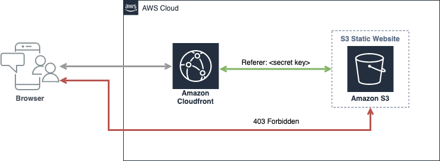

# Static website with AWS CDK



## Getting started

Install the AWS CDK using the following command.

```shell
npm install -g aws-cdk
```

Build and deploy

```shell
npm run build   # compile typescript to js
cdk synth       # emits the synthesized CloudFormation template
cdk deploy      # deploy this stack to your default AWS account/region
```

Using AWS profile

```shell
cdk deploy --profile tester
```

Deploy by stack name

```shell
cdk deploy ReactStack
```

Deploy all stacks

```shell
cdk deploy '*'
```
